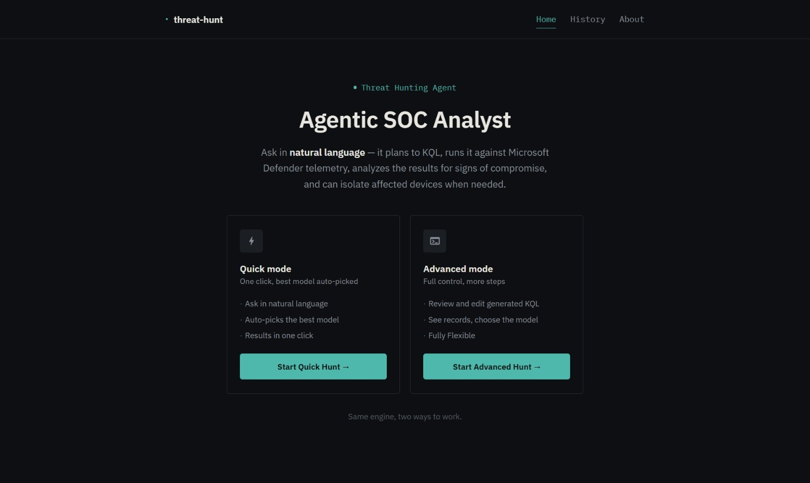
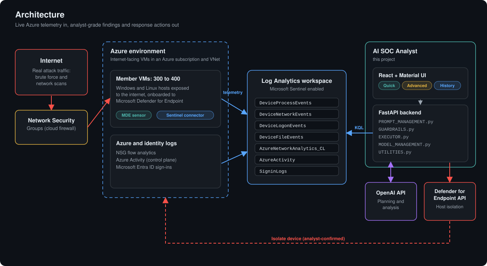
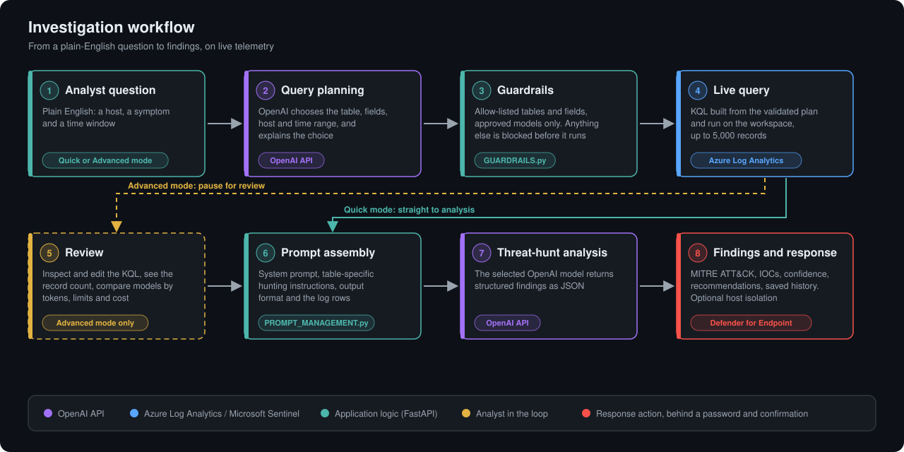
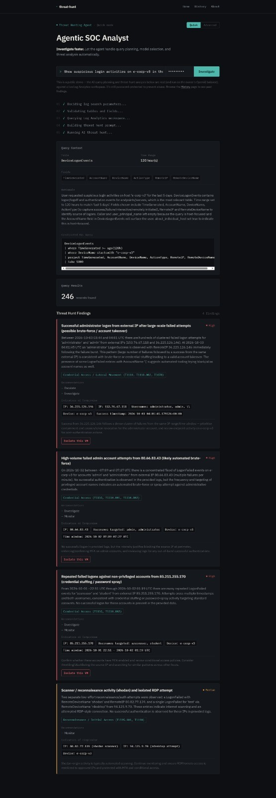
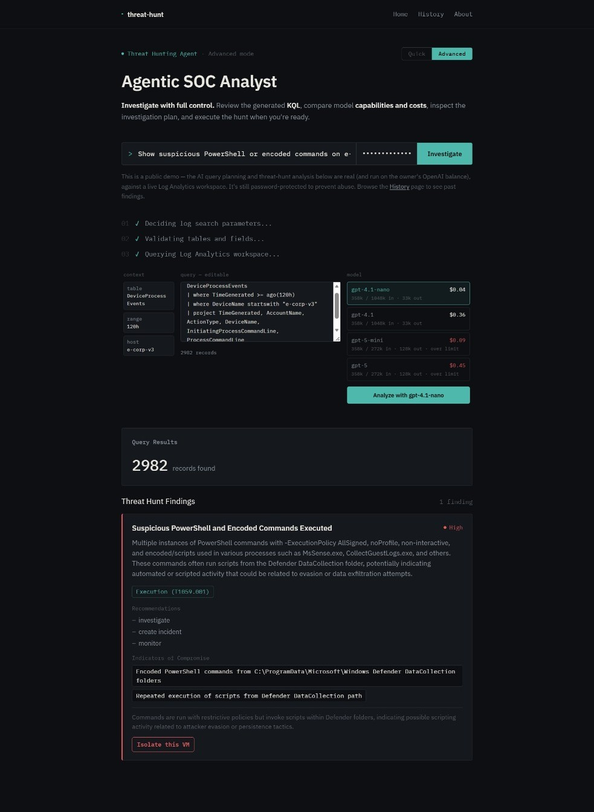
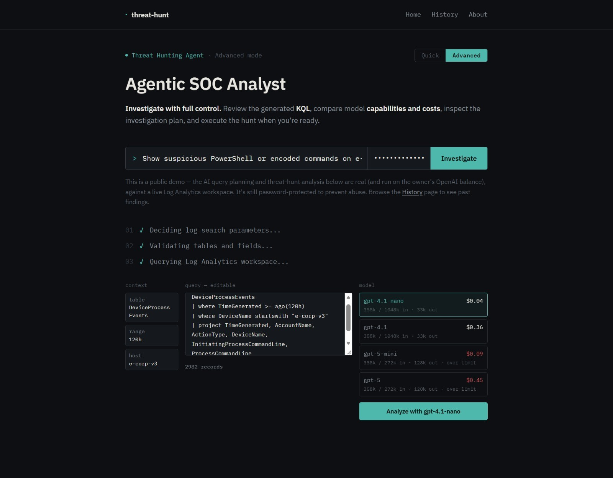
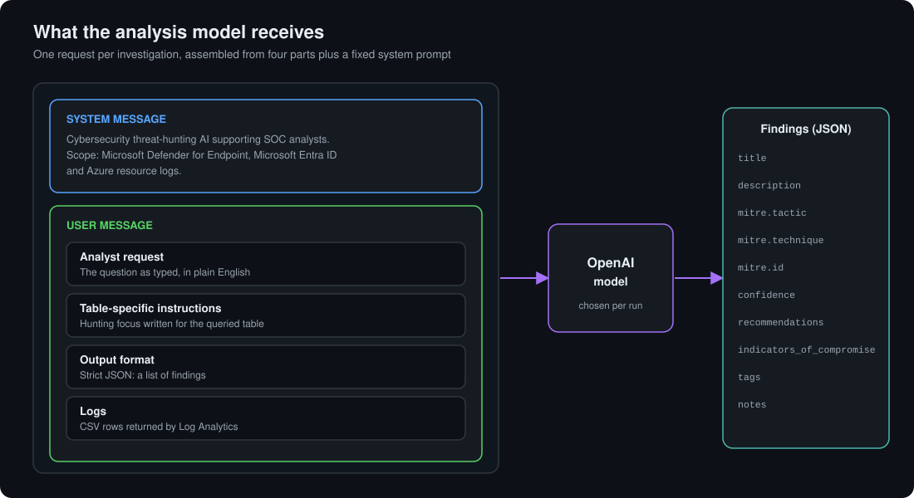
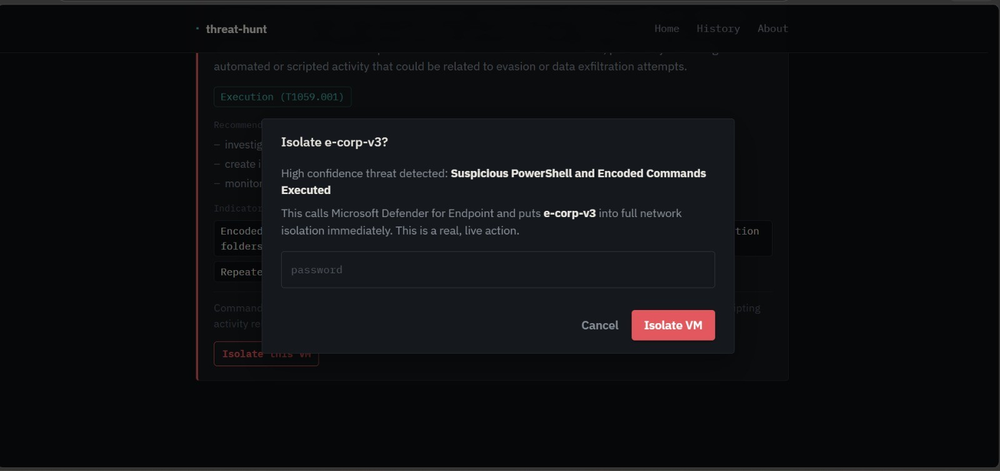
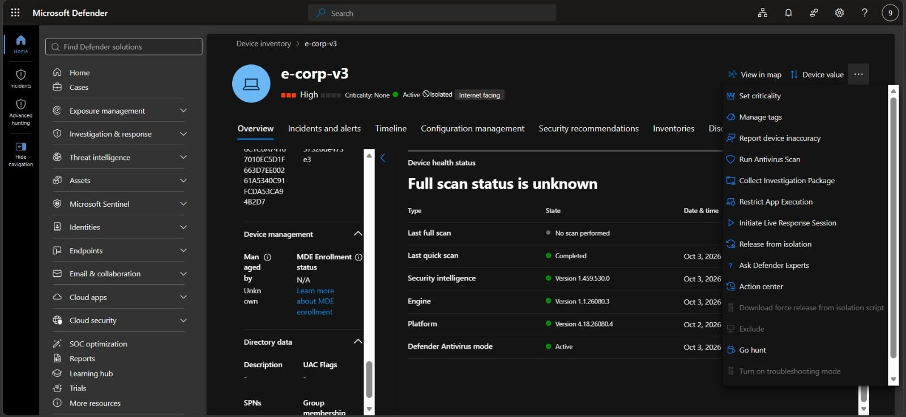
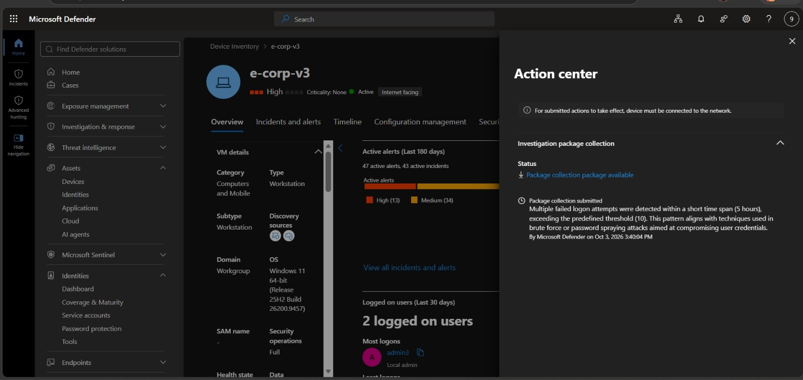

# AI Agentic SOC

**An LLM-powered threat hunting analyst for Microsoft Defender and Azure telemetry.**

  

Ask a security question in plain English. The agent plans the investigation, queries live telemetry in an Azure Log Analytics workspace with Microsoft Sentinel enabled, analyzes the results with an OpenAI model, and returns findings mapped to **MITRE ATT&CK**, with indicators of compromise, confidence levels and recommended actions. For a high-confidence finding on a single host, the analyst can isolate the machine through the **Microsoft Defender for Endpoint API**, after an explicit confirmation.

Everything runs against **live data**: Defender for Endpoint device telemetry, Azure activity and network flow logs, and Microsoft Entra ID sign-ins, collected from hundreds of internet-facing Windows and Linux virtual machines that receive real attack traffic.

## Highlights

- **Live telemetry.** Queries run on a production-style Log Analytics workspace with Defender for Endpoint, Microsoft Sentinel and Entra ID data. No sample datasets.
- **Two ways to work.** Quick mode goes from question to findings in one step. Advanced mode pauses for review, so the analyst can edit the KQL and choose the model.
- **Guardrails.** Every plan is checked against per-table field allow-lists and an approved model list before anything runs.
- **Cost aware.** Advanced mode estimates tokens, context limits and cost for each model before the analysis is executed.
- **Analyst-grade output.** Findings carry MITRE ATT&CK tactic, technique and ID, confidence, indicators of compromise and recommendations, and are saved to a searchable history.
- **Response action.** Full network isolation of a device through Microsoft Defender for Endpoint, behind a password and a confirmation dialog.

## Environment

The agent runs on top of an Azure environment of 300 to 400 Windows and Linux VMs, exposed to the internet behind Network Security Groups and onboarded to Microsoft Defender for Endpoint. Their telemetry, together with Azure activity, network flow analytics and Entra ID sign-ins, lands in a single Log Analytics workspace that the agent queries.

  

## Investigation workflow

  

| Module | Responsibility |
|---|---|
| `main.py` | FastAPI application. Streams each investigation step to the UI with Server-Sent Events |
| `PROMPT_MANAGEMENT.py` | Query-planning tool definition, system prompt, and table-specific hunting instructions |
| `GUARDRAILS.py` | Table and field allow-lists, approved models with limits and pricing |
| `EXECUTOR.py` | Log Analytics queries, threat-hunt analysis, Defender device isolation |
| `MODEL_MANAGEMENT.py` | Token counting and cost estimates per model |
| `UTILITIES.py` | Input sanitising and the findings history |

## Quick mode and Advanced mode

Both modes share the same engine. They differ in how much control the analyst has.

| Quick mode | Advanced mode |
|:---:|:---:|
|  |  |
| Question in, findings out. Progress is streamed step by step and the model is selected automatically. | The same findings, after reviewing the query context, the KQL and the model choice. |

### Advanced mode

Advanced mode stops after the query so the analyst can inspect what the agent decided before any analysis is paid for:

- **Query context:** the table, time range, host and fields the agent selected, with its rationale.
- **Editable KQL:** the generated query can be changed before it is used, and the record count updates for the query that actually ran.
- **Model comparison:** for `gpt-4.1-nano`, `gpt-4.1`, `gpt-5-mini` and `gpt-5`, it shows the input tokens against the context window, the output limit, whether the request fits the rate limit, and the estimated cost.
- **Run analysis:** one click with the chosen model.

  

## What the analysis model receives

Each investigation sends one request: a fixed system prompt, plus a user message made of the analyst's question, instructions written for the queried table, a strict output format and the log rows returned by Log Analytics.

  

## Response action: host isolation

When a finding is high confidence and concerns one host, the analyst can isolate it. The action calls the Microsoft Defender for Endpoint API for full network isolation and requires the access password and a confirmation.

  

  

  

## Telemetry covered

| Table | Source | Used to hunt for |
|---|---|---|
| `DeviceProcessEvents` | Microsoft Defender for Endpoint | Suspicious commands, PowerShell, encoded payloads |
| `DeviceNetworkEvents` | Microsoft Defender for Endpoint | Unusual outbound connections and ports |
| `DeviceLogonEvents` | Microsoft Defender for Endpoint | Brute force, password spraying, suspicious logons |
| `DeviceFileEvents` | Microsoft Defender for Endpoint | Dropped or modified files and their hashes |
| `AzureNetworkAnalytics_CL` | Azure NSG flow analytics | Malicious network flows |
| `AzureActivity` | Azure Activity log | Control-plane operations and the caller behind them |
| `SigninLogs` | Microsoft Entra ID | Failed and suspicious sign-ins |

Each table has an explicit list of fields the agent may select. Anything outside it is blocked.

## Sample prompts

- *Has windows-target-1 had any suspicious logons in the last 3 days?*
- *I'm worried that windows-target-1 might have been maliciously logged into in the last few days.*
- *We are suspicious of attacks against our tenant in the last couple days.*
- *Show suspicious login activities on e-corp-v3 in the last 5 days.*
- *Show suspicious PowerShell or encoded commands on e-corp-v3 in the last 5 days.*

## Safety

- Table and field allow-lists, and an approved model list, are enforced before every query and analysis.
- Investigation, planning, analysis and isolation endpoints are protected by an access password, checked with a constant-time comparison.
- Isolation needs the password and an explicit confirmation.
- Secrets live in environment variables. The findings history is excluded from version control.

## Built with

| | |
|---|---|
| **Frontend** | React, Vite, React Router, Material UI |
| **Backend** | Python, FastAPI, Uvicorn, pandas, Pydantic, tiktoken |
| **AI** | OpenAI API (`gpt-4.1-nano`, `gpt-4.1`, `gpt-5-mini`, `gpt-5`) |
| **Microsoft** | Azure Log Analytics, Microsoft Sentinel, Microsoft Defender for Endpoint, Microsoft Entra ID, Azure Monitor Query, Azure Identity |
| **Query language** | KQL |
